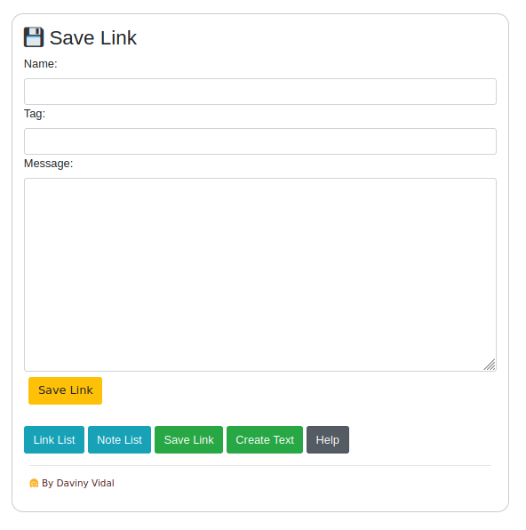

# Notepad Browser


  


[@github/davinyvidal](https://github.com/davinyvidal/)

[@github/davinyvidal/Notepad-Browser](https://github.com/davinyvidal/Notepad-Browser)


## 🚀 Objetivo

 - 🗒 Um bloco de nota rodando no navegar.
 - 🗒 Diferencial está na configuração do virtual Host com criação de três links local
    - http://create.notepad
    - http://file.notepad
    - http://link.notepad

## 🎥 Print Screen



## 🔎 Requisitos

* PHP 7.X
  * Testado no PHP 7.4.7
* Apache
* Sistema operacional que suporta Virtual Host
    * Aconselhamos usar um sistema baseado em Unix.

## 🎫 Árvore de pasta do projeto:

```bash
|---  file
|     | index.php
|     | conf.php
|     | functionFile.php
|     | file.php
|     | readme.html
|
|---  text
|     | index.php
|     | saved.php
|     | functionSaved.php
|
|---  link
|     | index.php
|     | saved.php
|     | functionSaved.php
|
| readme.md
| tela.png
| readme.html
| create.notepad.conf.exemplo
| link.notepad.conf.exemplo
| file.notepad.conf.exemplo

```

## 💾 Instalação Ubuntu Derivados

- Primeiro você tem que instalar o Apache e PHP 7.X

```bash
sudo apt install update
sudo apt install upgrade
sudo apt install apache2
sudo apt install php
sudo apt install git
```

- Clone do Instalador

```bash
cd ~/
sudo git clone git@github.com:divulgueinfo/Install-Notepad-Browser.git
cd Install-Notepad-Browser
sudo sh ./install.sh
```

- Quando terminar um pasta simbólica ficará na sua pasta Home com o nome __files__

## 📜 Lincença:

####  📢 Licença Pública Geral GNU v3.0
As permissões desta licença copyleft forte estão condicionadas a disponibilizar o código fonte completo das obras e modificações licenciadas, que incluem obras maiores usando uma obra licenciada, sob a mesma licença. Os avisos de direitos autorais e licença devem ser preservados. Os colaboradores fornecem uma concessão expressa de direitos de patente.

#### 👩 Considerações finais
Sistema feito 💜 pela Daviny Vidal.

Github @github/davinyvidal
Github @github/davinyvidal/Notepad-Browser